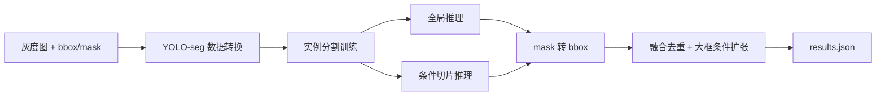
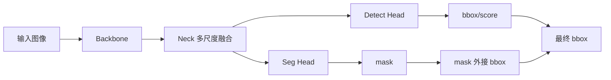

# 答辩演示提纲

本文用于制作答辩 PPT 或现场讲解，建议控制在 8-10 页。

## 1. 赛题与目标

- 任务：单通道芯片图像裂纹缺陷定位。
- 类别：`crack` 单类。
- 输出：每张测试图的 `predict_bboxes`。
- 重点指标：整体 mAP50、Recall、极小裂纹 Recall、推理耗时；极大裂纹 bbox IoU 作为定位质量诊断指标。

讲解重点：本方案以提交口径 mAP50 和召回为主线，同时单独监控小裂纹、超大图和大裂纹定位风险。

## 2. 数据难点

- 图像尺寸跨度：小图几十像素，超大图接近 7k x 9k。
- 裂纹形态：细长、不规则、低对比度。
- 极小目标：缩放后容易消失。
- 极大目标：切片后容易被截断。

可展示图：

- 小裂纹样本。
- 超大图长裂纹样本。
- 背景纹理误检样本。

## 3. 总体方案



讲解重点：

- 训练用 mask，提交用 bbox。
- 全局分支负责大裂纹整体结构。
- 条件切片负责小裂纹召回。

## 4. 模型架构



讲解重点：

- Backbone 提取裂纹纹理和边缘。
- Neck 融合 P3/P4/P5，多尺度覆盖小、中、大裂纹。
- Seg Head 让模型学习细长裂纹轮廓。

## 5. 小目标增强

- 使用较高推理尺寸 `imgsz=1280`。
- 低置信度阈值 `conf=0.01` 提高召回。
- 超大图低预测数时触发重叠切片。
- 评估单独统计 `tiny_recall_at_iou50`。

讲解风险：低阈值会增加误检，所以需要后处理融合和验证集调参。

## 6. 大目标定位诊断

- 超大图保留全局缩放分支，避免只看局部切片。
- 切片分支和全局分支共同参与融合。
- 仅对面积较大的预测框做轻微扩张，补偿长裂纹 mask 断裂或 bbox 偏小。
- 评估单独统计 `large_mean_matched_iou` 和 `large_mean_best_iou`，作为定位质量参考。

讲解风险：如果大裂纹错误明显影响 mAP50，可做 mask 连通域合并、bbox 校准和排序分数调整。

## 7. 推理加速

当前 hybrid 推理参数：

```text
direct_max_side=2048
global_max_side=1280
tile_size=1280
tile_overlap=256
tile_trigger=low_preds
max_tiles=8
```

效果：

- 测试集平均耗时 61.59ms。
- 最大单图耗时 1457.59ms。
- 比全量切片更稳定满足速度约束。

## 8. 实验结果

| 策略 | mAP50 | Recall | Tiny Recall | Large Best IoU | Max Time |
|---|---:|---:|---:|---:|---:|
| fast | 0.4090 | 0.6588 | 0.4706 | 0.4699 | 451.50ms |
| hybrid | 0.4169 | 0.6794 | 0.4706 | 0.4699 | 440.46ms |
| hybrid conf=0.04 | 0.4391 | 0.7088 | 0.6471 | 0.5247 | 459.10ms |
| hybrid conf=0.04 + large expand 0.12/12 | 0.4535 | 0.7206 | 0.6471 | 0.6097 | 约459ms |
| hybrid conf=0.01 + large expand 0.12/12 | 0.5053 | 0.7794 | 0.8235 | 0.6173 | 1437.19ms |
| hybrid conf=0.01 + large expand + tiny w2h6 | 0.5086 | 0.7853 | 0.9412 | 0.6173 | 1463.84ms |
| hybrid conf=0.01 + tiny w2h6 + elong 0.2 | 0.5089 | 0.7882 | 0.9412 | 0.6337 | 1475.15ms |
| hybrid conf=0.01 + tiny w2h6 + elong 0.2 + union floor0.5 | 0.5247 | 0.8471 | 0.9412 | 0.7698 matched / 0.8165 best | 1457.59ms |
| tile | 0.4019 | 0.6941 | 0.5882 | 0.5151 | 2568.23ms |

结论：当前最终提交使用 `ensemble_weighted_route_regular_gt100_fastdetbox768_warm`，继承 weighted ensemble 的验证指标 mAP50=0.5765、Recall=0.9147、Tiny Recall=0.9412，并通过 fast-detbox 路由使 regular max 降到 93.838ms。`w075_calibrated_demote` 可作为大裂纹定位参考指标更高的备选。

## 9. 错误案例

建议展示三类：

- 漏检：极细裂纹在缩放后消失。
- 误检：背景纹理被识别为裂纹。
- 定位不准：长裂纹被切片分裂，bbox IoU 偏低。

对应改进：

- 小目标重采样和切片训练。
- 背景负样本增强。
- 大裂纹 mask 连通域合并。

## 10. 现场演示流程

```bash
conda activate cpipc-crack

python src/check_submit.py \
  --dataset dataset \
  --submit outputs/submissions/results_seg_ref_yolo26n_hybrid_unionfloor05.json

python src/summarize_submission_time.py \
  --submit outputs/submissions/results_seg_ref_yolo26n_hybrid_unionfloor05.json

python src/visualize_predictions.py \
  --dataset dataset \
  --split test \
  --submit outputs/submissions/results_seg_ref_yolo26n_hybrid_unionfloor05.json \
  --limit 20
```

演示重点：

- 提交 JSON 格式合法。
- 权重、配置、结果、报告都在交付包中。
- 可通过配置文件修改模型和推理关键参数。
