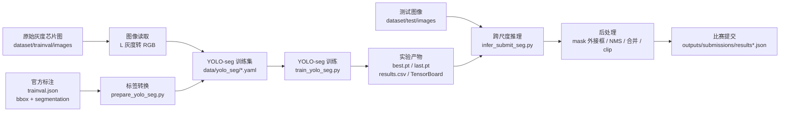
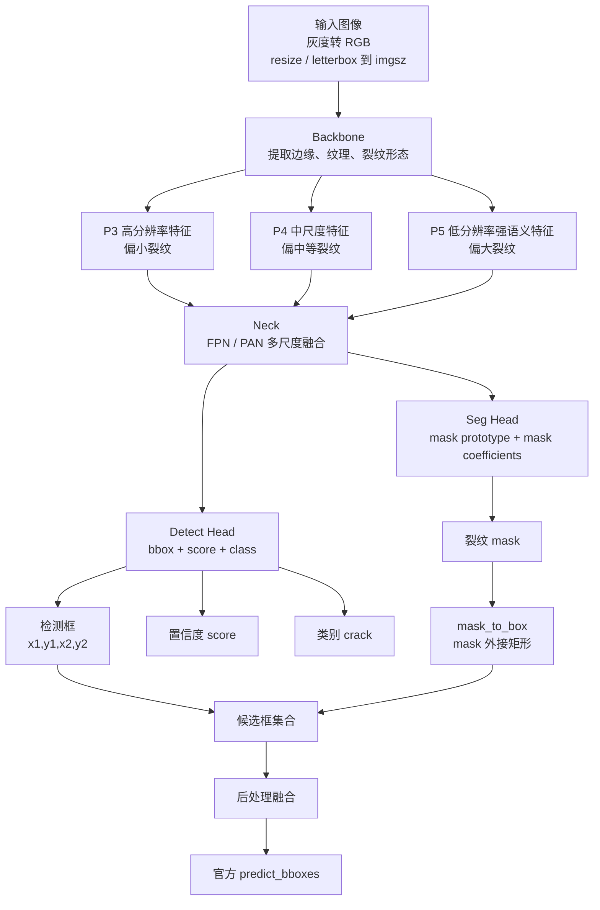
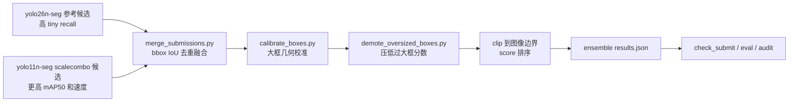

# 模型架构总览与改参入口

本文用于快速理解本项目的模型系统：数据从哪里来、进入模型前如何处理、模型输出什么、如何生成比赛提交文件，以及需要调参时应修改哪些位置。

## 1. 总体输入输出



核心输入：

- `dataset/trainval/images`：训练验证图像。
- `dataset/trainval/trainval.json`：训练标注，包含裂纹 bbox 和 segmentation。
- `dataset/test/images`：测试图像。
- `dataset/test/test.json`：测试图像清单。

核心输出：

- `runs/crack_yolo_seg/<exp>/weights/best.pt`：验证指标最好的权重，通常用于最终推理。
- `runs/crack_yolo_seg/<exp>/weights/last.pt`：最后一个 epoch 权重，可用于续训或回看训练终点。
- `runs/crack_yolo_seg/<exp>/results.csv`：每轮 loss、P、R、mAP 曲线数据。
- `runs/crack_yolo_seg/<exp>/events.out.tfevents*`：TensorBoard 曲线数据。
- `outputs/submissions/results*.json`：比赛提交文件。

## 2. YOLO-seg 模型框架



本项目采用实例分割路线，但最终仍提交 bbox。原因是分割模型可以学习裂纹的细长轮廓，推理时再把 mask 转为外接矩形，生成官方要求的 `predict_bboxes`。

## 3. 跨尺度推理与后处理

```mermaid
flowchart TD
    A[读取单张测试图] --> B{max(width,height)<br/><= direct_max_side?}

    B -- 是 --> C[常规图整图推理<br/>速度优先]
    B -- 否 --> D[大图全局缩放推理<br/>保护极大裂纹整体结构]
    B -- 否 --> E{是否触发切片}

    E -- 是 --> F[重叠切片推理<br/>tile_size / tile_overlap<br/>保护小裂纹]
    E -- 否 --> G[快速整图推理]

    C --> H[候选 bbox / mask]
    D --> I[坐标缩放回原图]
    F --> J[切片坐标平移回原图]
    G --> H
    I --> H
    J --> H

    H --> K[重复预测融合<br/>box IoU / mask IoU]
    K --> L[大框扩张<br/>提高极大裂纹 IoU]
    L --> M[细长裂纹合并<br/>修正被切碎预测]
    M --> N[极小框补偿<br/>保护小裂纹召回]
    N --> O[clip 到图像边界]
    O --> P[写入 results.json]
```

## 4. 当前推荐融合候选

当前验证集综合最优候选不是单模型输出，而是两个 YOLO-seg 候选的 bbox 级融合：



验证集当前结果：

| 候选 | mAP50 | Recall@IoU50 | Tiny Recall | Large Matched IoU | Large Best IoU |
| --- | ---: | ---: | ---: | ---: | ---: |
| `yolo26n_ref_unionfloor05` | 0.5247 | 0.8471 | 0.9412 | 0.7698 | 0.8165 |
| `yolo11n_scalecombo` | 0.5462 | 0.8412 | 0.7647 | 0.7236 | 0.8260 |
| `ensemble_y26_y11_weighted` | 0.5765 | 0.9147 | 0.9412 | 0.7981 | 0.8356 |
| `ensemble_y26_y11_w075_calibrated` | 0.5555 | 0.9147 | 0.9412 | 0.8318 | 0.8706 |
| `ensemble_y26_y11_w075_calibrated_demote` | 0.5579 | 0.9147 | 0.9412 | 0.8509 | 0.8706 |

结论：

- `ensemble_y26_y11_weighted` 是验证集 mAP50/Recall 最优的质量基线，但测试集 regular 单张最大耗时超过 100ms。
- 当前最终提交采用 `ensemble_weighted_route_regular_gt100_fastdetbox768_warm`：保留 weighted ensemble 的验证指标，并把 24 张历史 regular 慢图路由到 `yolo11n fast detbox768` 分支，regular max 降到 93.838ms。
- `ensemble_y26_y11_w075_calibrated_demote` 在大裂纹定位参考指标上更高，可作为定位更稳的备选。
- Large IoU 保留为大裂纹定位质量诊断参考，不作为当前交付硬门槛。

最终 speed-route 复现入口：

```bash
bash scripts/reproduce_final_speed_route.sh
```

weighted 质量基线复现入口：

```bash
bash scripts/reproduce_ensemble_weighted.sh
```

大裂纹定位更稳备选候选的后处理参数：

```bash
python src/merge_submissions.py \
  --inputs outputs/submissions/results_seg_ref_yolo26n_hybrid_unionfloor05.json \
           outputs/submissions/results_yolo11n_seg_scalecombo_best_candidate.json \
  --out outputs/submissions/results_ensemble_y26_y11_w075_raw.json \
  --iou-thr 0.75 \
  --mode weighted \
  --max-preds 300 \
  --dataset dataset

python src/calibrate_boxes.py \
  --submit outputs/submissions/results_ensemble_y26_y11_w075_raw.json \
  --out outputs/submissions/results_ensemble_y26_y11_w075_calibrated.json \
  --dataset dataset \
  --min-area 90000 \
  --min-side 700 \
  --min-aspect 3 \
  --scale-x 1.08 \
  --scale-y 1.04 \
  --long-scale 0.96 \
  --short-scale 0.95

python src/demote_oversized_boxes.py \
  --submit outputs/submissions/results_ensemble_y26_y11_w075_calibrated.json \
  --out outputs/submissions/results_ensemble_y26_y11_w075_calibrated_demote.json \
  --min-area 90000 \
  --contain-iou 0.55 \
  --area-ratio 1.6 \
  --demote-factor 0.25 \
  --demote-below 0.49 \
  --competitor-score-min 0.45
```

关键参数：

| 参数 | 作用 |
| --- | --- |
| `--iou-thr` | 两个候选框 IoU 高于该阈值时视作重复框 |
| `--mode weighted` | 用面积加权方式融合重复框坐标 |
| `--mode higher_score` | 保留最高分框，召回稳定但框几何不融合 |
| `--mode union` | 取并集框，可能提升召回但容易框过大 |
| `--max-preds` | 每张图最多保留预测框数量 |
| `--dataset` | 用于读取图像尺寸并 clip bbox，避免提交越界 |
| `--demote-factor` | 对过大且被更紧候选覆盖的框降低分数，避免抢占大裂纹匹配 |

交付包权重结构：

```text
deliverables/ensemble_weighted_route_regular_gt100_fastdetbox768_warm_candidate/weights/
  yolo26n_ref_unionfloor05.pth      # 参考模型，高 tiny recall
  yolo11n_scalecombo_best.pth       # 200 epoch scalecombo 模型，高 mAP50
  ensemble_weighted_route_regular_gt100_fastdetbox768_warm_candidate.pth  # 主权重副本，保留用于单模型加载检查
```

完整复现脚本：

```text
scripts/reproduce_ensemble_weighted.sh
```

该脚本会依次执行：

```text
yolo26n 推理 -> yolo11n 推理 -> merge_submissions.py weighted 融合 -> check_submit.py
```

## 5. 常用改参位置

| 想调整的目标 | 首选修改文件 | 关键参数 |
| --- | --- | --- |
| 训练模型、轮数、输入尺寸 | `configs/yolo_seg_crack_hybrid.yaml` | `train.model`、`train.imgsz`、`train.epochs`、`train.batch` |
| 训练增强强度 | `src/train_yolo_seg.py` | `degrees`、`translate`、`scale`、`mosaic`、`mixup`、`hsv_v` |
| 小裂纹召回 | `configs/yolo_seg_crack_hybrid.yaml` | `infer.conf`、`infer.imgsz`、`tile_size`、`tile_overlap`、`tiny_box_*` |
| 大裂纹 IoU | `configs/yolo_seg_crack_hybrid.yaml` | `global_max_side`、`box_expand_*`、`elongated_box_*`、`union_cluster_*` |
| 推理速度 | `configs/yolo_seg_crack_hybrid.yaml` | `direct_resize_max_side`、`global_max_side`、`max_tiles`、`tile_trigger` |
| 评估阈值 | `configs/yolo_seg_crack_hybrid.yaml` | `eval.iou_match`、`eval.tiny_width`、`eval.tiny_area`、`eval.large_area` |
| 模型融合 | `src/merge_submissions.py` | `--iou-thr`、`--mode`、`--score-scale`、`--max-preds` |
| 大框离线变体 | `src/search_large_box_postprocess.py` | `--expand-*`、`--shrink-*`、`--shift-*`、`--score-floor` |
| 大框分数重排 | `src/rescore_submission.py`、`src/rescore_large_clusters.py` | `--large-floor`、`--long-floor`、`--cluster-iou` |
| 大框直接校准 | `src/calibrate_boxes.py` | `--scale-x`、`--scale-y`、`--long-scale`、`--short-scale` |

更完整的参数解释见 `docs/parameter_map.md`。

## 6. 当前主线实验

当前主线训练命令：

```bash
python src/train_yolo_seg.py \
  --config configs/yolo_seg_crack_hybrid.yaml \
  --data-yaml data/yolo_seg/crack_seg_scaleaware_scalecrop.yaml \
  --model /home/ruiyi/CPIPC/跨尺度芯片图像的裂纹缺陷智能检测算法设计/yolo11n-seg.pt \
  --imgsz 1024 --epochs 200 --batch 2 --device 0 \
  --tag seg-scaleaware-scalecrop
```

当前主线实验目录：

```text
runs/crack_yolo_seg/yolo11n-seg_cpipc-chip-crack-seg_img1024_ep200_bs2_seed42_seg-scaleaware-scalecrop
```

TensorBoard 查看方式：

```bash
tensorboard --logdir runs experiments --host 0.0.0.0 --port 6006
```

浏览器打开：

```text
http://localhost:6006
```

## 7. 已有 SVG 架构图

项目已提供三张可直接打开的 SVG：

- `docs/assets/system_pipeline.svg`：整体训练、推理、提交流程。
- `docs/assets/yolo_seg_architecture.svg`：YOLO-seg 网络结构。
- `docs/assets/inference_postprocess.svg`：跨尺度推理和后处理流程。

打开命令：

```bash
xdg-open docs/assets/system_pipeline.svg
xdg-open docs/assets/yolo_seg_architecture.svg
xdg-open docs/assets/inference_postprocess.svg
```
