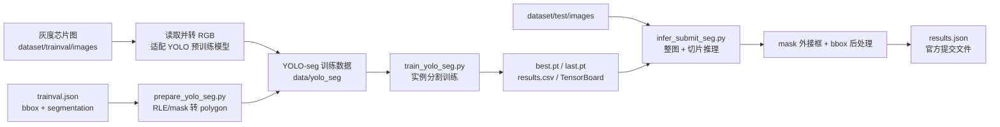
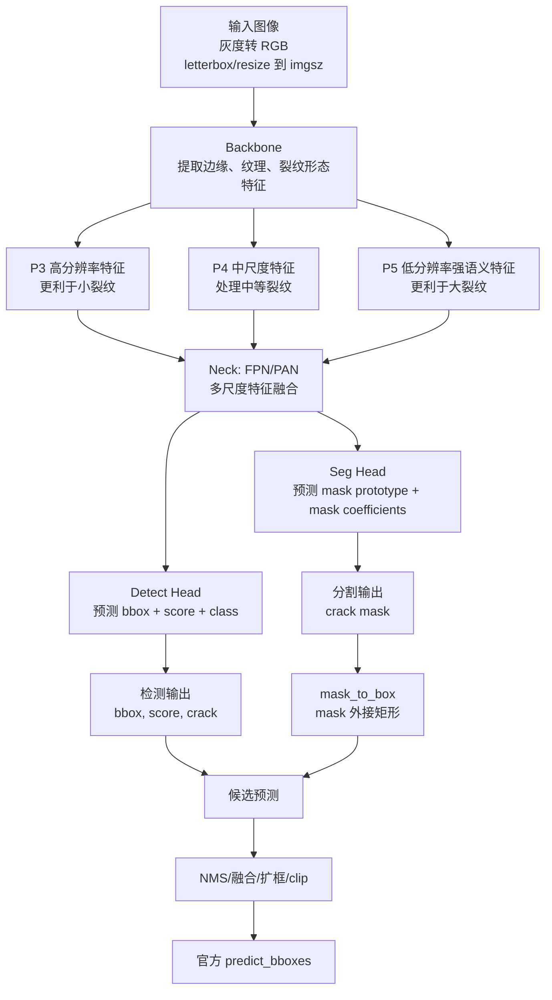
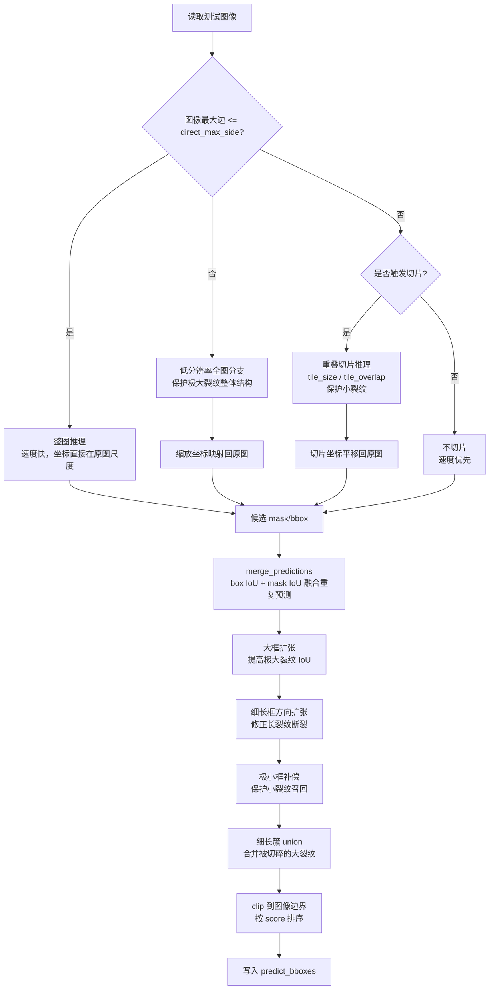

# 模型框架、输入输出与关键参数说明

本文面向后续调参和答辩说明，重点解释本项目 YOLO-seg 裂纹检测/分割系统的输入、输出、模型架构、训练产物、推理后处理和关键可修改参数。

可直接打开的架构图：

- [整体系统流程图](assets/system_pipeline.svg)
- [YOLO-seg 模型架构图](assets/yolo_seg_architecture.svg)
- [跨尺度推理与后处理图](assets/inference_postprocess.svg)

当前推荐主线不是单纯检测模型，而是：

```text
官方 bbox + segmentation 标注 -> YOLO 实例分割训练 -> mask/bbox 预测 -> 转换为官方 bbox 提交
```

这样可以利用裂纹的像素级轮廓信息，同时最终仍输出赛题要求的 `predict_bboxes`。

## 1. 数据输入与监督信息

### 原始输入

```text
dataset/
  trainval/
    images/          # 训练验证图像，灰度芯片图
    trainval.json    # 训练标注，含 bbox 和 segmentation
  test/
    images/          # 测试图像，灰度芯片图
    test.json        # 测试清单，无真实标注
```

训练阶段每个裂纹对象可使用两类监督：

- `bbox`：矩形框，格式来自官方 JSON，表示裂纹大致位置。
- `segmentation`：裂纹掩膜，表示裂纹像素区域，可转换为 YOLO-seg polygon 标签。

测试阶段只有图像和图片清单，模型需要预测裂纹位置。

### 输入输出总览图

独立 SVG 版本：[docs/assets/system_pipeline.svg](assets/system_pipeline.svg)



## 2. YOLO-seg 模型架构

YOLO-seg 可以理解为在 YOLO 检测框架上增加了 mask 分支。它同时输出：

- 检测框：`x1, y1, x2, y2`
- 置信度：`score`
- 类别：本项目固定为 `crack`
- 裂纹 mask：像素级裂纹区域，后续转换为 bbox 辅助提交

### 模型结构图

独立 SVG 版本：[docs/assets/yolo_seg_architecture.svg](assets/yolo_seg_architecture.svg)



### 为什么用分割模型也能提交 bbox

赛题提交核心是裂纹位置。实例分割模型输出的 mask 可以通过外接矩形转换为 bbox：

```text
mask 中所有裂纹像素的最小 x/y 和最大 x/y -> [x1, y1, x2, y2]
```

因此分割模型既能利用更细的监督信息，又能生成官方 bbox 提交。当前项目的 `src/infer_submit_seg.py` 就是执行这个转换。

## 3. 训练系统与实验产物

训练入口：

```text
src/train_yolo_seg.py
```

主配置：

```text
configs/yolo_seg_crack_hybrid.yaml
```

训练输出默认进入：

```text
runs/crack_yolo_seg/<experiment_name>/
```

重要产物：

```text
weights/best.pt       # 验证指标最好的权重，通常用于最终推理
weights/last.pt       # 最后一个 epoch 的权重，用于续训或对比
args.yaml             # Ultralytics 实际训练参数
results.csv           # 每个 epoch 的 loss、P/R、mAP 等指标
events.out.tfevents*  # TensorBoard 曲线文件
*.png                 # 训练曲线、PR 曲线、混淆矩阵等可视化图
```

本项目还提供实验归档工具：

```text
src/archive_experiment.py
src/experiment_utils.py
```

归档后会保存：

```text
experiments/<experiment_name>/
  checkpoints/
    <exp>__best_epochXX_mAP50-XXXX.pt
    <exp>__last_epochYY.pt
  reports/
    args.yaml
    results.csv
  tensorboard/
    events.out.tfevents...
  experiment.json
  experiment.yaml
```

实验命名规则由 `src/experiment_utils.py::build_experiment_name()` 生成，包含：

```text
模型名_数据集名_img输入尺寸_ep训练轮数_bs批大小_seed随机种子_tag实验标签
```

示例：

```text
yolo11n-seg_cpipc-chip-crack-seg_img1024_ep200_bs2_seed42_seg-hybrid
```

## 4. 推理与提交系统架构

推理入口：

```text
src/infer_submit_seg.py
```

输出：

```text
outputs/submissions/results_seg.json
```

推荐候选输出：

```text
outputs/submissions/results_seg_ref_yolo26n_hybrid_unionfloor05.json
```

### 跨尺度推理流程图

独立 SVG 版本：[docs/assets/inference_postprocess.svg](assets/inference_postprocess.svg)



## 5. 关键参数速查

### 数据与标签转换参数

位置：

```text
configs/yolo_seg_crack_hybrid.yaml
src/prepare_yolo_seg.py
```

关键项：

```yaml
segmentation:
  epsilon_ratio: 0.0005
  max_points: 400
```

- `epsilon_ratio`：mask 轮廓转 polygon 的简化强度。越大点数越少、轮廓越粗；越小越贴合但标签更复杂。
- `max_points`：每个裂纹 polygon 最多点数。细长裂纹过度简化时可以适当增大。

### 训练参数

位置：

```text
configs/yolo_seg_crack_hybrid.yaml
src/train_yolo_seg.py
```

关键项：

```yaml
train:
  model: yolo11n-seg.pt
  imgsz: 1024
  epochs: 200
  batch: 2
  patience: 50
  close_mosaic: 20
  mask_ratio: 4
```

常见修改：

- `model`：改模型大小，例如 `yolo11s-seg.pt`、`yolo11m-seg.pt`。模型越大可能精度越高，但更慢、更吃显存。
- `imgsz`：输入尺寸。小裂纹漏检多时优先从 `1024` 提到 `1280`；显存不足时降低。
- `epochs`：训练轮数。曲线未收敛时增加；过拟合明显时减少或使用更强正则。
- `batch`：批大小。显存不足直接减小。
- `patience`：早停等待轮数。
- `close_mosaic`：最后若干 epoch 关闭 mosaic，通常有利于定位稳定。
- `mask_ratio`：mask 损失/分辨率相关参数，影响 mask 学习精度与显存。

训练增强在 `src/train_yolo_seg.py` 的 `model.train(...)` 中：

```python
degrees=90
translate=0.06
scale=0.35
fliplr=0.5
flipud=0.5
mosaic=0.8
mixup=0.03
hsv_v=0.25
```

解释：

- `degrees`：旋转增强，适合芯片裂纹方向不固定的情况。
- `translate/scale`：平移和缩放，增强尺度变化鲁棒性。
- `fliplr/flipud`：水平/垂直翻转。
- `mosaic/mixup`：组合增强，提高泛化，但过强可能影响细小裂纹定位。
- `hsv_v`：亮度增强，适应灰度图明暗变化。

### 推理参数

位置：

```text
configs/yolo_seg_crack_hybrid.yaml
src/infer_submit_seg.py
```

核心阈值：

```yaml
infer:
  imgsz: 1280
  conf: 0.01
  iou: 0.55
  max_det: 300
```

- `conf`：置信度阈值。降低可提高召回，误检也会增加；当前候选用 `0.01` 保小裂纹。
- `iou`：模型内部 NMS 阈值。重复框多可降低；裂纹被过度合并可提高。
- `max_det`：每张图最多保留预测数。

跨尺度相关：

```yaml
direct_max_side: 2048
direct_resize_max_side: 1280
global_max_side: 1280
adaptive_global_max_side: 0
adaptive_global_threshold: 0
tile_size: 1280
tile_overlap: 256
tile_trigger: low_preds
tile_min_global_preds: 1
max_tiles: 8
prediction_box_source: mask_box
retina_masks: true
include_global_for_large: true
keep_masks_for_merge: true
```

- `direct_max_side`：小于该最大边的图走整图推理。
- `direct_resize_max_side`：常规图快速缩放阈值。`0` 表示不缩放；大于 0 时，`max_side<=direct_max_side` 且超过该阈值的图会先缩放到该最大边推理，再把 bbox 映射回原图。当前 `960/1280` 在验证集指标不变，能降低测试平均耗时，但仍未完全解决单张最大耗时。
- `global_max_side`：大图全图分支缩放后的最大边。
- `adaptive_global_max_side/adaptive_global_threshold`：按原图最大边自适应选择全图分支尺寸。两者都大于 0 时，`max(width,height)<=adaptive_global_threshold` 的图像使用更高的 `adaptive_global_max_side`，超大图仍使用 `global_max_side` 控制耗时。
- `tile_size`：切片大小。越小越利于小目标，但上下文少、耗时可能增加。
- `tile_overlap`：切片重叠，防止裂纹跨边界被截断。
- `tile_trigger`：切片触发策略；当前 `low_preds` 表示全图预测太少时再补切片。
- `max_tiles`：每张图最多切片数量，用于控制最坏耗时。
- `prediction_box_source`：提交框来源，支持 `mask_box`、`det_box`、`prefer_mask`。当前推荐 `mask_box`；`det_box + no_retina` 验证 mAP50 降到 `0.4221`、Large Matched IoU 降到 `0.2488`，不适合作为最终提交。
- `retina_masks`：是否让 Ultralytics 输出原图尺度 mask。当前推荐 `true`，否则 mask_box 不再可靠，只能走检测框快速分支。
- `include_global_for_large`：是否保留大图低分辨率全图分支，主要保护大裂纹。
- `keep_masks_for_merge`：是否保留全图 mask 做 mask IoU 融合。当前推荐 `true`，因为关闭后 Tiny Recall 从 `0.9412` 降到 `0.8235`；仅建议作为速度消融实验。

后处理相关：

```yaml
box_iou_merge: 0.5
mask_iou_merge: 0.35
box_expand_ratio: 0.12
box_expand_pixels: 12.0
box_expand_min_area: 90000.0
tiny_box_min_width: 2.0
tiny_box_min_height: 6.0
tiny_box_max_area: 80.0
elongated_box_expand_ratio: 0.2
elongated_box_min_area: 30000.0
elongated_box_min_aspect: 3.0
union_elongated_clusters: true
union_cluster_score_factor: 0.2
union_cluster_score_floor: 0.5
union_cluster_score_area_norm: 90000.0
union_cluster_box_source: mask_box
large_box_variants: false
large_variant_expand_ratio: 0.0
large_variant_shrink_ratio: 0.0
large_variant_directional_expand_ratio: 0.0
large_variant_source_filter: all
```

- `box_iou_merge/mask_iou_merge`：合并重复预测。
- `box_expand_*`：对大裂纹框做适度扩张，提升极大裂纹 bbox IoU。
- `tiny_box_*`：对极小裂纹框做最小宽高补偿，避免四舍五入后框过窄。
- `elongated_box_*`：对细长裂纹沿长轴扩张。
- `union_elongated_clusters`：把同方向、相邻的长裂纹预测合并成额外 union 框，缓解大裂纹被切碎的问题。
- `union_cluster_score_factor`：union 框分数折扣。越小越不容易影响高置信预测排序，但可能影响 mAP 曲线。
- `union_cluster_score_floor`：union 框最低分数。大裂纹好框分数过低、被差框抢先匹配时可提高；当前主提交按 mAP50/召回优先，不强制使用 IoU 优先设置。若只做大裂纹定位参考消融，可提高到 `0.5`；若追求整体 mAP，可降回 `0.2` 或使用 weighted ensemble。
- `union_cluster_score_area_norm`：面积相关分数下限的归一化面积。大于 0 时，union 框越大越接近 `score_floor`，小 union 框不会被过度提分。
- `union_cluster_box_source`：union 簇合并使用的框源。`box` 使用最终扩张后的提交框；`mask_box` 使用 mask 原始外接框，更干净；`prefer_mask` 优先使用 mask 外接框，没有 mask 时回退到提交框。当前推荐 `mask_box`。
- `large_box_variants`：为大面积预测框额外生成少量扩张/收缩变体。默认关闭，主要用于验证大裂纹框形状修正是否能提升 Large IoU。
- `large_variant_expand_ratio/shrink_ratio/directional_expand_ratio`：控制大框变体的等比例扩张、等比例收缩、单轴扩张/收缩。生成的是额外低分候选，不直接替换原框。
- `large_variant_source_filter`：限制大框变体来源。`all` 处理全部大框，`union` 只处理长裂纹合并框，`model` 只处理模型原始预测框。

## 6. 验证指标与错误分析输出

验证入口：

```text
src/eval_submission.py
```

常用命令：

```bash
python src/eval_submission.py \
  --config configs/yolo_seg_crack_hybrid.yaml \
  --submit outputs/submissions/val_pred.json \
  --split val \
  --out outputs/reports/submission_metrics_val.json \
  --errors outputs/reports/submission_errors_val.csv
```

输出指标包括：

- `mAP50`：IoU=0.5 下的平均精度，和赛题 bbox 评价最相关。
- `precision_at_conf`：固定阈值下预测为裂纹的准确率。
- `recall_at_iou50`：IoU>=0.5 时真实裂纹被找回的比例。
- `tiny_recall_at_iou50`：极小裂纹召回。
- `large_mean_matched_iou`：已匹配极大裂纹的平均 IoU。
- `large_mean_best_iou`：每个极大裂纹能找到的最佳预测 IoU。

错误分析 CSV：

```text
outputs/reports/*errors*.csv
```

主要用于定位：

- FN：漏检裂纹，常见于极小、低对比度、贴边裂纹。
- FP：误检背景纹理，常见于芯片划痕、边缘纹理、噪声。
- low-score TP：模型找到了但置信度低，说明 `conf` 阈值需要谨慎。
- large low IoU：大裂纹被切碎、框偏小或方向扩张不足。

## 7. 推荐调参路径

### 小裂纹漏检多

优先改：

```yaml
infer.conf: 0.005 或 0.01
train.imgsz: 1280
infer.imgsz: 1280 或 1536
tile_size: 1024 或 1280
tile_overlap: 256 或 384
```

观察：

- `tiny_recall_at_iou50` 是否上升。
- FP 是否明显增加。
- 平均推理耗时是否仍可接受。

### 大裂纹 IoU 低

优先改：

```yaml
include_global_for_large: true
box_expand_ratio: 0.08 到 0.16
elongated_box_expand_ratio: 0.1 到 0.25
union_elongated_clusters: true
union_cluster_max_gap: 128 到 384
```

观察：

- `large_mean_best_iou` 是否上升。
- mAP50 是否因为额外 union 框而下降。

### 误检多

优先改：

```yaml
infer.conf: 0.03 或 0.05
union_cluster_score_factor: 更低
mosaic: 0.5 或训练后期更早关闭
mixup: 0.0
```

观察：

- `precision_at_conf` 是否上升。
- `recall_at_iou50` 是否下降过多。

### 推理太慢

优先改：

```yaml
tile_size: 0
tile_trigger: none
max_tiles: 更小
global_max_side: 1024
model: 更小模型
```

观察：

- `avg_inference_time_ms`
- `max_inference_time_ms`
- 大图和小图分桶耗时

## 8. 常用运行命令

```bash
cd /home/ruiyi/CPIPC/Dection
conda activate cpipc-crack

# 1. 数据转 YOLO-seg
python src/prepare_yolo_seg.py --config configs/yolo_seg_crack_hybrid.yaml

# 2. 训练，自动生成规范实验名并归档
python src/train_yolo_seg.py \
  --config configs/yolo_seg_crack_hybrid.yaml \
  --model yolo11n-seg.pt \
  --imgsz 1024 \
  --epochs 200 \
  --batch 2

# 2b. 可选：尺度感知重采样训练，增强 tiny/large/huge 样本
python src/build_scale_aware_train_list.py \
  --config configs/yolo_seg_crack_hybrid.yaml \
  --out-suffix scaleaware

python src/train_yolo_seg.py \
  --config configs/yolo_seg_crack_hybrid.yaml \
  --data-yaml data/yolo_seg/crack_seg_scaleaware.yaml \
  --model yolo11n-seg.pt \
  --imgsz 1024 \
  --epochs 200 \
  --batch 2 \
  --tag seg-scaleaware

# 2c. 可选：局部尺度 crop 训练，增强 tiny/large 样本的局部监督
python src/build_scale_crop_dataset.py \
  --config configs/yolo_seg_crack_hybrid.yaml \
  --out-suffix scalecrop \
  --crop-size 1024 \
  --context 2.5 \
  --tiny-repeat 2 \
  --large-repeat 1 \
  --max-crops-per-image 4

python src/train_yolo_seg.py \
  --config configs/yolo_seg_crack_hybrid.yaml \
  --data-yaml data/yolo_seg/crack_seg_scalecrop.yaml \
  --model yolo11n-seg.pt \
  --imgsz 1024 \
  --epochs 200 \
  --batch 2 \
  --tag seg-scalecrop

# 2d. 推荐下一轮长训：整图重采样 + 局部 crop 组合训练集
python src/build_combined_yolo_data.py \
  --config configs/yolo_seg_crack_hybrid.yaml \
  --out-suffix scaleaware_scalecrop \
  --train-lists data/yolo_seg/train_scaleaware.txt data/yolo_seg/train_scalecrop_only.txt

python src/train_yolo_seg.py \
  --config configs/yolo_seg_crack_hybrid.yaml \
  --data-yaml data/yolo_seg/crack_seg_scaleaware_scalecrop.yaml \
  --model yolo11n-seg.pt \
  --imgsz 1024 \
  --epochs 200 \
  --batch 2 \
  --tag seg-scaleaware-scalecrop

# 2e. 长训前数据预检
python src/check_yolo_seg_data.py \
  --data-yaml data/yolo_seg/crack_seg_scaleaware_scalecrop.yaml \
  --out outputs/reports/check_crack_seg_scaleaware_scalecrop.json

# 2f. 可选：1 epoch smoke train，只验证链路，不报告正式指标
python src/train_yolo_seg.py \
  --config configs/yolo_seg_crack_hybrid.yaml \
  --data-yaml data/yolo_seg/crack_seg_scaleaware_scalecrop.yaml \
  --model /home/ruiyi/CPIPC/跨尺度芯片图像的裂纹缺陷智能检测算法设计/yolo11n-seg.pt \
  --imgsz 640 \
  --epochs 1 \
  --batch 1 \
  --device 0 \
  --name yolo11n_seg_scalecombo_smoke \
  --tag seg-scalecombo-smoke \
  --no-archive

# 2g. 可选：流水线入口，统一调度 prepare/check/smoke/train/eval/package
python scripts/run_pipeline.py --stages prepare check smoke --dry-run
python scripts/run_pipeline.py --stages check
python scripts/run_pipeline.py --stages train --epochs 200 --batch 2 --device 0

# 3. TensorBoard 查看训练曲线
tensorboard --logdir runs/crack_yolo_seg

# 4. 验证集推理
python src/infer_submit_seg.py \
  --config configs/yolo_seg_crack_hybrid.yaml \
  --weights runs/crack_yolo_seg/<experiment_name>/weights/best.pt \
  --split val \
  --out outputs/submissions/val_pred_seg.json

# 5. 计算验证指标和错误分析
python src/eval_submission.py \
  --config configs/yolo_seg_crack_hybrid.yaml \
  --submit outputs/submissions/val_pred_seg.json \
  --split val \
  --out outputs/reports/submission_metrics_val.json \
  --errors outputs/reports/submission_errors_val.csv

# 5b. 可选：极大裂纹 IoU 诊断与可视化
python src/diagnose_large_iou.py \
  --config configs/yolo_seg_crack_hybrid.yaml \
  --submit outputs/submissions/val_pred_seg.json \
  --split val \
  --out-csv outputs/reports/large_iou_diagnosis_val.csv \
  --out-json outputs/reports/large_iou_diagnosis_val.json

python src/visualize_large_iou_cases.py \
  --dataset dataset \
  --diagnosis-csv outputs/reports/large_iou_diagnosis_val.csv \
  --out-dir outputs/visualizations/large_iou_cases_val \
  --limit 12 \
  --max-side 1600

# 6. 测试集推理生成提交
python src/infer_submit_seg.py \
  --config configs/yolo_seg_crack_hybrid.yaml \
  --weights runs/crack_yolo_seg/<experiment_name>/weights/best.pt \
  --split test \
  --out outputs/submissions/results_seg.json

# 7. 检查提交合法性
python src/check_submit.py \
  --dataset dataset \
  --submit outputs/submissions/results_seg.json
```

## 9. 当前推荐候选说明

当前已验证的候选不是本机重新训练得到，而是使用队友 YOLO26n-seg 训练权重作为参考权重，并在本项目中完成验证、后处理调参和提交生成。

权重：

```text
/home/ruiyi/CPIPC/跨尺度芯片图像的裂纹缺陷智能检测算法设计/runs/yolo26n_seg_baseline-2/weights/best.pt
```

配置：

```text
configs/yolo_seg_crack_hybrid.yaml
```

提交：

```text
outputs/submissions/results_seg_ref_yolo26n_hybrid_unionfloor05.json
```

已记录验证指标：

```text
mAP50 = 0.5247
Recall@IoU50 = 0.8471
Tiny Recall@IoU50 = 0.9412
Large Mean Matched IoU = 0.7698
Large Mean Best IoU = 0.8165
```

注意：这些指标来自本项目验证脚本和固定验证划分，不等同于官方测试集最终分数。后续每改一次参数，都应保存新的提交、指标 JSON、错误 CSV 和实验配置。
