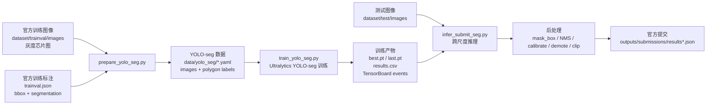
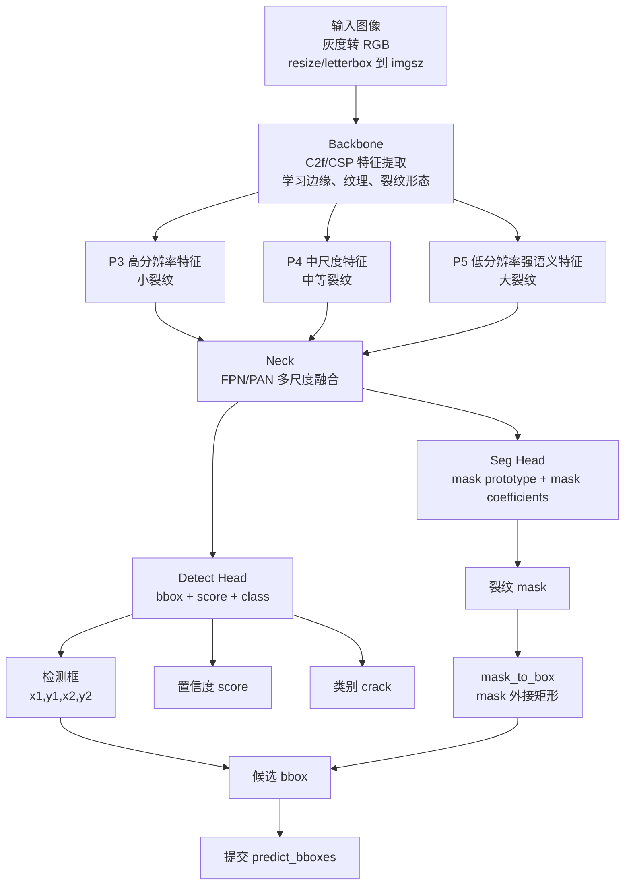
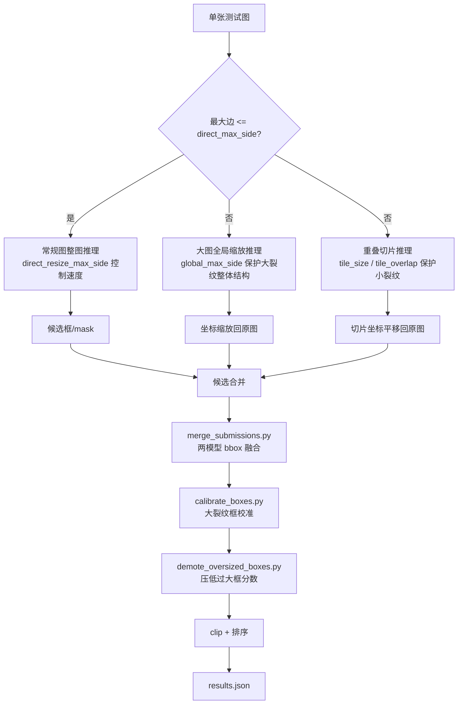

# 模型输入输出与架构速查

本文用于快速回答三个问题：

1. 数据从哪里进入模型。
2. YOLO-seg 模型内部由哪些模块组成。
3. 想改模型或关键参数时应该改哪里。

可直接打开的图：

- `docs/assets/system_pipeline.svg`
- `docs/assets/yolo_seg_architecture.svg`
- `docs/assets/inference_postprocess.svg`

## 1. 输入输出总图



输入：

- `dataset/trainval/images`：训练验证图片。
- `dataset/trainval/trainval.json`：训练标注，含 `bbox` 和 `segmentation`。
- `dataset/test/images`：测试图片。
- `configs/yolo_seg_crack_hybrid.yaml`：训练、推理、后处理参数。

输出：

- `runs/crack_yolo_seg/<exp>/weights/best.pt`：验证最优 ckpt。
- `runs/crack_yolo_seg/<exp>/weights/last.pt`：最后 epoch ckpt。
- `runs/crack_yolo_seg/<exp>/results.csv`：每轮训练指标。
- `runs/crack_yolo_seg/<exp>/events.out.tfevents*`：TensorBoard 曲线。
- `outputs/submissions/results*.json`：比赛提交。
- `experiments/<exp>/`：归档后的 ckpt、结果和 TensorBoard 文件。

## 2. YOLO-seg 网络架构



模块解释：

- Backbone：提取裂纹边缘、局部纹理和全局形态特征。
- Neck：融合多尺度特征，解决同一数据集中图片尺寸跨度大、小裂纹和大裂纹同时存在的问题。
- Detect Head：输出矩形框、置信度和类别。
- Seg Head：输出裂纹 mask；本项目优先使用 `mask_box`，即 mask 外接矩形作为提交框来源。

## 3. 跨尺度推理与后处理



当前最终提交候选：

```text
ensemble_weighted_route_regular_gt100_fastdetbox768_warm_candidate
```

验证集指标：

```text
mAP50 = 0.5765
Recall@IoU50 = 0.9147
Tiny Recall@IoU50 = 0.9412
Large Matched IoU = 0.7981
Large Best IoU = 0.8356
```

大裂纹定位参考指标更高的备选：

```text
ensemble_y26_y11_w075_calibrated_demote_candidate
mAP50 = 0.5579
Large Matched IoU = 0.8509
Large Best IoU = 0.8706
```

审计状态：

```text
Tiny Recall: PASS
Large Matched IoU: reference metric
Large Best IoU: reference metric
Submission schema: PASS
Regular single-image speed: FAIL
```

说明：按当前项目口径，不再把 `Large Matched IoU >= 0.85` 作为必须继续优化的目标；大裂纹 IoU 仍保留用于分析框定位质量。

## 4. 最常改的参数

训练参数位置：`configs/yolo_seg_crack_hybrid.yaml`

```yaml
train:
  model: yolo11n-seg.pt
  imgsz: 1024
  epochs: 200
  batch: 2
  patience: 50
  close_mosaic: 20
  mask_ratio: 4
```

推理参数位置：`configs/yolo_seg_crack_hybrid.yaml`

```yaml
infer:
  imgsz: 1280
  conf: 0.01
  iou: 0.55
  direct_resize_max_side: 1280
  global_max_side: 1280
  tile_size: 1280
  tile_overlap: 256
  prediction_box_source: mask_box
  retina_masks: true
```

后处理参数入口：

```text
src/infer_submit_seg.py
src/merge_submissions.py
src/calibrate_boxes.py
src/demote_oversized_boxes.py
```

调参方向：

| 目标 | 优先修改 |
| --- | --- |
| 小裂纹漏检 | 增大 `train.imgsz/infer.imgsz`，降低 `infer.conf`，增大 `tile_overlap` |
| 大裂纹定位偏差 | 作为参考消融调 `global_max_side`、`box_expand_*`、`calibrate_boxes.py`、`demote_oversized_boxes.py` |
| 误检多 | 提高 `infer.conf`，降低 union/demote 相关低分候选影响，检查错误 CSV |
| 推理慢 | 降低 `direct_resize_max_side/global_max_side`，限制 `max_tiles`，用单模型快速路径 |
| 显存不足 | 降低 `train.imgsz` 或 `batch`，使用 `n` 系列模型 |

## 5. TensorBoard 与 ckpt 查看

启动 TensorBoard：

```bash
cd /home/ruiyi/CPIPC/Dection
conda activate cpipc-crack
tensorboard --logdir runs,experiments --host 0.0.0.0 --port 6006
```

浏览器打开：

```text
http://localhost:6006
```

实验归档命令：

```bash
python src/archive_experiment.py \
  --run-dir runs/crack_yolo_seg/<exp> \
  --config configs/yolo_seg_crack_hybrid.yaml \
  --data-yaml data/yolo_seg/crack_seg_scaleaware_scalecrop.yaml \
  --tag <tag>
```

归档后重点查看：

```text
experiments/<exp>/checkpoints/*best_epoch*.pt
experiments/<exp>/checkpoints/*last_epoch*.pt
experiments/<exp>/reports/results.csv
experiments/<exp>/reports/args.yaml
experiments/<exp>/tensorboard/
experiments/<exp>/experiment.json
```
