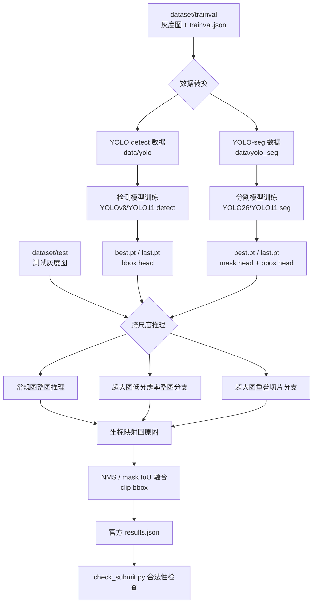
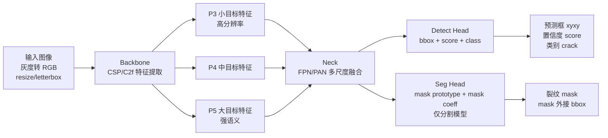

# 跨尺度芯片裂纹检测模型系统架构

本文用于快速理解本项目的输入、输出、模型系统、训练/推理流程和关键可调参数。当前工程主线是 YOLO-seg 实例分割训练，再将 mask/bbox 预测转换为官方要求的 bbox JSON 提交；检测 baseline 保留为速度和稳定性对照。

可直接打开的架构图：

- [整体系统流程图](assets/system_pipeline.svg)
- [YOLO-seg 模型架构图](assets/yolo_seg_architecture.svg)
- [跨尺度推理与后处理图](assets/inference_postprocess.svg)

## 1. 任务输入与输出

### 输入

- 原始数据目录：`dataset/`
- 训练验证集：`dataset/trainval/images` 与 `dataset/trainval/trainval.json`
- 测试集：`dataset/test/images` 与 `dataset/test/test.json`
- 图像类型：单通道灰度芯片图，代码中会转成 RGB 以适配 Ultralytics YOLO 预训练模型。
- 标注信息：每个裂纹对象包含 `bbox`、`segmentation`、`ObjectCategory=crack`。

### 输出

最终提交文件为 JSON：

```text
outputs/submissions/results.json
```

每张测试图片输出：

```json
{
  "ID": 2,
  "image path": "images/3.jpg",
  "inference_time_ms": 15.6,
  "groundtruth_bboxes": [],
  "predict_bboxes": [
    {
      "x1": 10,
      "y1": 20,
      "x2": 100,
      "y2": 200,
      "score": 0.85,
      "label": "crack"
    }
  ]
}
```

检测模型直接输出 bbox；分割模型先输出 mask，再由 mask 外接矩形转换为 bbox。最终以 `predict_bboxes` 为核心提交内容。

## 2. 整体工程流程图

独立 SVG 版本：[docs/assets/system_pipeline.svg](assets/system_pipeline.svg)



## 3. 模型框架图

YOLO 检测模型结构可以理解为三部分：Backbone、Neck、Head。

独立 SVG 版本：[docs/assets/yolo_seg_architecture.svg](assets/yolo_seg_architecture.svg)



### 各模块作用

- Backbone：提取纹理、边缘、裂纹形态等视觉特征。
- Neck：融合不同尺度特征，解决小裂纹和大裂纹同时存在的问题。
- Detect Head：输出矩形框、置信度和类别。
- Seg Head：输出像素级裂纹掩膜，适合细长、不规则裂纹；最终可转为 bbox 提交。

## 4. 跨尺度推理架构

独立 SVG 版本：[docs/assets/inference_postprocess.svg](assets/inference_postprocess.svg)

```mermaid
flowchart TD
    A[读取测试图] --> B{max(width,height) <= direct_max_side?}

    B -- 是 --> C[整图推理<br/>imgsz]
    B -- 否 --> D[全图缩放推理<br/>保护极大裂纹整体结构]
    B -- 否 --> E[重叠切片推理<br/>tile_size / tile_overlap<br/>保护极小裂纹]

    C --> F[预测框或 mask]
    D --> G[缩放坐标还原]
    E --> H[切片坐标平移还原]

    F --> I[合并候选]
    G --> I
    H --> I

    I --> J[NMS 或 mask IoU 融合]
    J --> K[clip 到图像边界]
    K --> L[按 score 排序]
    L --> M[写入 results.json]
```

这个流程对应当前主推代码中的 `src/infer_submit_seg.py`。检测 baseline 对应 `src/infer_submit.py`，主要用于速度优先或保底对照。

## 5. 关键参数位置

当前实例分割主配置：

```text
configs/yolo_seg_crack_hybrid.yaml
```

### 训练参数

```yaml
train:
  model: yolo11n-seg.pt
  imgsz: 1024
  epochs: 200
  batch: 2
  workers: 4
  patience: 50
  close_mosaic: 20
  mask_ratio: 4
```

- `model`：模型权重。可改为 `yolo11s-seg.pt`、`yolo11m-seg.pt`、`yolo26n-seg.pt` 等分割模型。
- `imgsz`：训练输入尺寸。小裂纹召回不足时优先增大到 `1280`。
- `epochs`：训练轮数。未收敛时增加；过拟合时减少或依赖 early stopping。
- `batch`：批大小。显存不足时减小。
- `patience`：早停耐心值。
- `close_mosaic`：最后若干 epoch 关闭 mosaic，提升定位稳定性。
- `mask_ratio`：mask 分支训练相关参数，会影响 mask 学习、显存占用和分割质量。

训练增强目前写在：

```text
src/train_yolo_seg.py
```

核心增强参数：

```python
degrees=90
translate=0.08
scale=0.4
fliplr=0.5
flipud=0.5
mosaic=0.8
mixup=0.03
hsv_v=0.25
```

小裂纹漏检多时，建议：

- 增大 `imgsz`
- 减小过强 `scale`
- 使用切片训练或更高分辨率训练
- 降低推理 `conf`

误检多时，建议：

- 提高 `conf`
- 降低过强增强
- 检查背景纹理误检样本

### 推理参数

```yaml
infer:
  imgsz: 1280
  conf: 0.01
  iou: 0.55
  max_det: 300
  direct_max_side: 2048
  direct_resize_max_side: 1280
  prediction_box_source: mask_box
  retina_masks: true
  tile_size: 1280
  tile_overlap: 256
  include_global_for_large: true
  keep_masks_for_merge: true
```

- `imgsz`：推理尺寸。越大越利于小目标，但耗时更高。
- `conf`：置信度阈值。小裂纹召回低时降低；误检多时提高。
- `iou`：NMS 阈值。重复框多时降低；裂纹被误合并时提高。
- `direct_max_side`：小于该尺寸的图走整图推理。
- `direct_resize_max_side`：常规图快速缩放阈值。用于把接近 2048 的常规图缩放后推理，再映射回原图，减少平均耗时。
- `prediction_box_source`：提交 bbox 来源。`mask_box` 使用裂纹 mask 外接框，当前精度最好；`det_box` 速度更快但本项目验证会显著降低极大裂纹 IoU。
- `retina_masks`：是否输出原图尺度 mask。需要高质量 mask_box 时保持 `true`。
- `global_max_side`：超大图整图分支的最大缩放边长，速度优先时降低该值。
- `tile_size`：超大图切片尺寸。小裂纹漏检时可减小或保持较大输入分辨率。
- `tile_overlap`：切片重叠。裂纹跨切片边界时增大。
- `include_global_for_large`：超大图是否加低分辨率整图分支，用于保护极大裂纹。
- `tile_size=0`：禁用切片，进入快速整图推理模式，适合测速和速度优先提交。
- `configs/yolo_seg_crack_fast.yaml`：快速推理配置，默认不切片，优先满足耗时约束。
- `tile_trigger`：切片触发策略，`always` 为全量切片，`low_preds` 为全图预测较少时补切片。
- `max_tiles`：限制每张超大图最多切片数量，用于控制最大推理耗时。
- `configs/yolo_seg_crack_hybrid.yaml`：混合推理配置，兼顾速度和召回。
- `keep_masks_for_merge`：是否保留全图 mask 做 mask IoU 融合。默认保留，关闭会加速但当前验证显示会明显降低小目标召回。
- `union_cluster_box_source`：细长裂纹簇合并的框源，支持 `box`、`mask_box`、`prefer_mask`；当前推荐 `mask_box`。
- `union_cluster_score_floor`：union 框最低分数；当前 IoU 优先候选为 `0.5`。
- `tiny_box_*`：极小框补偿参数，用于提高极小裂纹召回。
- `elongated_box_*`：细长裂纹方向扩张参数，用于缓解长裂纹被切碎或框偏小。

### 评估参数

```yaml
eval:
  iou_match: 0.5
  tiny_width: 5
  tiny_area: 50
  large_area: 90000
```

- `iou_match`：验证匹配阈值，赛题综合精度关注 mAP50，对应 IoU 0.5。
- `tiny_width/tiny_area`：极小裂纹统计阈值。
- `large_area`：极大裂纹统计阈值，`90000 = 300 * 300`。

## 6. 推荐高分路线

### 基线路线

目标：稳定生成合法提交。

```text
YOLO detect -> bbox -> results.json
```

优点：

- 工程简单。
- 推理速度快。
- 提交格式直接。

不足：

- 未充分利用 `segmentation` 标注。
- 对细长裂纹的轮廓信息利用不足。

### 强化路线

目标：利用全部监督信息，提高定位质量和召回。

```text
RLE mask -> YOLO-seg polygon -> YOLO-seg 训练 -> mask/bbox -> results.json
```

优点：

- 利用像素级 mask 标注。
- 对细长、弯曲裂纹更友好。
- 可由 mask 外接框得到更贴合的 bbox。

风险：

- 推理和后处理更慢。
- mask 转 polygon 的参数会影响细裂纹质量。
- 最终仍需严格输出官方 bbox JSON。

### 最终提交建议

1. 用检测 baseline 作为保底提交。
2. 主推 YOLO-seg 模型，使用同一验证集比较 bbox mAP50、极小 Recall、极大 mean IoU、推理耗时。
3. 当前 IoU 优先候选为 `outputs/submissions/results_seg_ref_yolo26n_hybrid_unionfloor05.json`。
4. 当前交付包为 `deliverables/yolo26n_seg_ref_hybrid_unionfloor05_iou_candidate`。
5. 若后续 YOLO-seg 超时或误检过多，再回退到检测模型或更快的 `configs/yolo_seg_crack_fast.yaml`。

## 7. 常用命令

```bash
cd /home/ruiyi/CPIPC/Dection
conda activate cpipc-crack

# 数据检查
python src/data_analyze.py --dataset dataset --out outputs/reports/data_stats.json

# 分割数据转换
python src/prepare_yolo_seg.py --config configs/yolo_seg_crack_hybrid.yaml

# 分割训练
python src/train_yolo_seg.py --config configs/yolo_seg_crack_hybrid.yaml --model yolo11n-seg.pt --imgsz 1024 --epochs 200 --batch 2

# 生成验证集预测并按提交口径评估
python src/infer_submit_seg.py \
  --config configs/yolo_seg_crack_hybrid.yaml \
  --weights runs/crack_yolo_seg/<exp>/weights/best.pt \
  --split val \
  --out outputs/submissions/val_pred_seg.json

python src/eval_submission.py \
  --config configs/yolo_seg_crack_hybrid.yaml \
  --submit outputs/submissions/val_pred_seg.json \
  --split val \
  --out outputs/reports/submission_metrics_val.json \
  --errors outputs/reports/submission_errors_val.csv

# 推理提交
python src/infer_submit_seg.py \
  --config configs/yolo_seg_crack_hybrid.yaml \
  --weights runs/crack_yolo_seg/<exp>/weights/best.pt \
  --split test \
  --out outputs/submissions/results_seg.json

# 提交检查
python src/check_submit.py --dataset dataset --submit outputs/submissions/results_seg.json
```

## 8. 修改模型的最小路径

如果只想改模型大小或输入尺寸，优先改命令行参数：

```bash
python src/train_yolo.py \
  --config configs/yolo_crack.yaml \
  --model yolov8m.pt \
  --imgsz 1280 \
  --epochs 200 \
  --batch 2
```

如果要改默认参数，修改：

```text
configs/yolo_seg_crack_hybrid.yaml
```

如果要改训练增强，修改：

```text
src/train_yolo_seg.py
```

如果要改滑窗、阈值、NMS 和提交后处理，修改：

```text
src/infer_submit_seg.py
configs/yolo_seg_crack_hybrid.yaml
```

如果要走实例分割高分路线，参考：

```text
configs/yolo_seg_crack.yaml
src/prepare_yolo_seg.py
src/train_yolo_seg.py
src/infer_submit_seg.py
```

可视化训练标注和提交预测框：

```text
src/visualize_predictions.py
```
