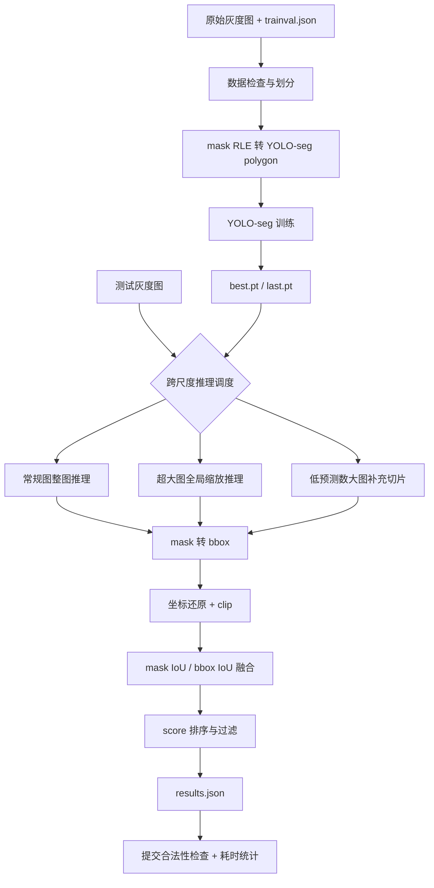
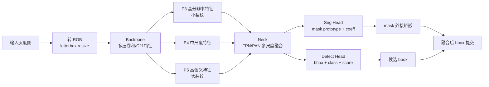

# 跨尺度芯片图像裂纹缺陷智能检测技术设计报告

## 1. 任务理解

本赛题要求在单通道灰度芯片图像中定位裂纹缺陷，类别只有 `crack`。训练集提供 bbox 和 segmentation 标注，最终提交以每张测试图的 `predict_bboxes` 为核心结果，评价重点包含极小裂纹召回、极大裂纹 bbox IoU、全测试集 bbox mAP50 和推理耗时。

本项目采用“实例分割训练 + bbox 提交”的方案：训练阶段利用 mask 监督学习细长裂纹轮廓，推理阶段将预测 mask 转成外接 bbox，再经过跨尺度融合与 NMS 后写入官方提交 JSON。这样既利用了像素级标注，又兼容 bbox 评分规则。

## 2. 数据分析结论

已检查数据位于 `dataset/`：

```text
dataset/trainval/images
dataset/trainval/trainval.json
dataset/test/images
dataset/test/test.json
```

关键统计：

| 项目 | 数值 |
|---|---:|
| 训练图像 | 1285 |
| 测试图像 | 301 |
| 训练 bbox | 1652 |
| 类别 | crack |
| 图像通道 | 单通道灰度 |
| 训练分辨率范围 | 宽 45-7468，高 46-9267 |
| 测试分辨率范围 | 宽 46-7445，高 47-9250 |
| 极小目标 | 79 |
| 极大目标 | 83 |

主要难点：

- 图像尺度跨度极大，直接统一缩放会损失极小裂纹。
- 极细裂纹宽度可能只有数个像素，低分辨率输入下容易消失。
- 超大图中的长裂纹容易被切片截断，导致 bbox IoU 偏低。
- 裂纹形态细长、不规则，bbox 监督对边界和形态利用不足。
- 单类数据但目标尺度分布不均衡，整体 mAP 不能完全反映极小和极大目标表现。

## 3. 整体方案架构



## 4. 模型框架

当前推荐候选使用参考 YOLO26n-seg 权重。模型系统由 Backbone、Neck、Detect Head 和 Seg Head 组成。



选择实例分割路线的原因：

- 训练集存在 `segmentation` 标注，可以利用完整监督信息。
- 裂纹细长且不规则，mask 对轮廓学习比 bbox 更直接。
- 最终评分以 bbox 为主时，可由 mask 外接矩形得到提交框。
- seg 模型同时输出 bbox 和 mask，便于做 bbox/mask 双口径后处理。

## 5. 数据预处理与增强策略

### 5.1 数据转换

入口：

```bash
python src/prepare_yolo_seg.py --config configs/yolo_seg_crack_hybrid.yaml
```

处理内容：

- 固定随机种子 `seed=42`，按 `val_ratio=0.2` 生成 train/val。
- 将官方 JSON 中的 RLE mask 转成 YOLO-seg polygon。
- bbox 坐标统一 clip 到图像边界。
- 生成 `data/yolo_seg/crack_seg.yaml` 和 `split_manifest.yaml`，保证可复现。

### 5.2 推荐增强

训练增强由 Ultralytics 训练参数控制，适合本任务的增强包括：

| 增强 | 目的 |
|---|---|
| 水平/垂直翻转 | 芯片裂纹方向不固定，提升方向鲁棒性 |
| 90 度旋转或小角度旋转 | 适配不同拍摄方向 |
| 亮度/对比度扰动 | 适配灰度图成像差异 |
| Mosaic 后期关闭 | 前期增加上下文，后期提升定位稳定性 |
| 多尺度训练 | 提升跨尺度泛化 |
| 小目标重采样 | 提高极小裂纹出现频率 |

注意：过强缩放会让极细裂纹消失，后续调参应重点监控 tiny recall。

## 6. 训练策略

当前推荐配置：

```yaml
train:
  model: yolo11n-seg.pt
  imgsz: 1024
  epochs: 200
  batch: 2
  patience: 50
  close_mosaic: 20
  mask_ratio: 4
```

当前最佳实际候选使用参考项目训练得到的 YOLO26n-seg `best.pt`，并在当前工程中完成统一验证和提交生成。当前工程已经跑通 YOLO11n-seg 20 epoch baseline，但指标明显低于参考 200 epoch 权重，因此最终推荐先使用参考权重作为比赛候选。

为提升极小裂纹召回和极大裂纹定位质量，当前工程新增尺度感知重采样训练入口：

```bash
python src/build_scale_aware_train_list.py \
  --config configs/yolo_seg_crack_hybrid.yaml \
  --out-suffix scaleaware \
  --tiny-repeat 3 \
  --large-repeat 3 \
  --huge-repeat 2 \
  --tiny-large-repeat 4 \
  --max-repeat 4

python src/train_yolo_seg.py \
  --config configs/yolo_seg_crack_hybrid.yaml \
  --data-yaml data/yolo_seg/crack_seg_scaleaware.yaml \
  --model yolo11n-seg.pt \
  --imgsz 1024 \
  --epochs 200 \
  --batch 2 \
  --tag seg-scaleaware
```

已生成的清单统计如下：

```text
base_train_images=1028
repeated_train_rows=1274
tiny_images=51
large_images=64
huge_images=43
repeat_histogram={1: 897, 2: 16, 3: 115}
```

该策略通过提高 tiny/large/huge 样本出现频率，让训练阶段更关注评分硬指标相关样本。当前仅完成清单生成和入口实现，尚未完成 200 epoch 长训，因此不报告未验证指标。

另一个训练侧增强入口是局部尺度 crop 训练：

```bash
python src/build_scale_crop_dataset.py \
  --config configs/yolo_seg_crack_hybrid.yaml \
  --out-suffix scalecrop \
  --crop-size 1024 \
  --context 2.5 \
  --tiny-repeat 2 \
  --large-repeat 1 \
  --max-crops-per-image 4

python src/train_yolo_seg.py \
  --config configs/yolo_seg_crack_hybrid.yaml \
  --data-yaml data/yolo_seg/crack_seg_scalecrop.yaml \
  --model yolo11n-seg.pt \
  --imgsz 1024 \
  --epochs 200 \
  --batch 2 \
  --tag seg-scalecrop
```

已生成数据统计：

```text
base_train_images=1028
crop_images=187
combined_train_rows=1215
tiny_crop_records=120
large_crop_records=67
```

该策略只从 train split 生成局部图，不改变验证集。tiny 裂纹在 crop 中相对变大，有利于小目标学习；large 裂纹提供局部细节视角，有利于 mask 和 bbox 边界学习。当前同样尚未完成 200 epoch 长训，因此不报告未验证指标。

推荐下一轮长训优先使用“整图尺度重采样 + 局部 crop”的组合数据：

```bash
python src/build_combined_yolo_data.py \
  --config configs/yolo_seg_crack_hybrid.yaml \
  --out-suffix scaleaware_scalecrop \
  --train-lists data/yolo_seg/train_scaleaware.txt data/yolo_seg/train_scalecrop_only.txt

python src/train_yolo_seg.py \
  --config configs/yolo_seg_crack_hybrid.yaml \
  --data-yaml data/yolo_seg/crack_seg_scaleaware_scalecrop.yaml \
  --model yolo11n-seg.pt \
  --imgsz 1024 \
  --epochs 200 \
  --batch 2 \
  --tag seg-scaleaware-scalecrop
```

已校验组合清单：

```text
train_scaleaware rows=1274
train_scalecrop_only rows=187
combined rows=1461
unique rows=1215
missing_images=0
missing_labels=0
empty_labels=0
```

该组合训练集同时保留原图上下文、提高 tiny/large/huge 图像采样频率，并加入局部 crop 监督，是当前最值得长训验证的训练侧改进候选。

长训前数据预检：

```bash
python src/check_yolo_seg_data.py \
  --data-yaml data/yolo_seg/crack_seg_scaleaware_scalecrop.yaml \
  --out outputs/reports/check_crack_seg_scaleaware_scalecrop.json
```

当前预检结果：

```text
ok=True
train_rows=1461
train_unique=1215
train_duplicates=246
val_rows=257
test_rows=301
failures=[]
```

其中 train duplicates 是有意保留的过采样行，不属于数据错误。预检覆盖图片路径、标签路径、空标签、polygon 坐标范围和 train/val 泄漏。

组合数据 smoke train：

```bash
python src/train_yolo_seg.py \
  --config configs/yolo_seg_crack_hybrid.yaml \
  --data-yaml data/yolo_seg/crack_seg_scaleaware_scalecrop.yaml \
  --model /home/ruiyi/CPIPC/跨尺度芯片图像的裂纹缺陷智能检测算法设计/yolo11n-seg.pt \
  --imgsz 640 \
  --epochs 1 \
  --batch 1 \
  --device 0 \
  --name yolo11n_seg_scalecombo_smoke \
  --tag seg-scalecombo-smoke \
  --no-archive
```

结果：训练链路跑通，train 扫描 1461 张、val 扫描 257 张，0 corrupt；生成 `best.pt`、`last.pt`、`args.yaml`、`results.csv`、`results.png` 和 PR/F1 曲线图。该 1 epoch run 仅用于验证数据和训练入口，不作为正式性能指标。

统一流水线入口：

```bash
python scripts/run_pipeline.py --stages prepare check smoke --dry-run
python scripts/run_pipeline.py --stages check
python scripts/run_pipeline.py --stages train --epochs 200 --batch 2 --device 0
```

`scripts/run_pipeline.py` 支持 `prepare`、`check`、`smoke`、`train`、`eval-ref`、`submit-ref` 和 `package` 阶段，默认不会启动长训，必须显式指定 `--stages train`。

训练监控指标：

- `train/box_loss`、`train/seg_loss`、`train/cls_loss`、`train/dfl_loss`
- `val/box_loss`、`val/seg_loss`
- `metrics/precision(B)`、`metrics/recall(B)`、`metrics/mAP50(B)`
- `metrics/precision(M)`、`metrics/recall(M)`、`metrics/mAP50(M)`

实验归档规范：

```text
{model}_{dataset}_img{imgsz}_ep{epochs}_bs{batch}_seed{seed}_{tag}
```

训练 run、best/last 权重、`results.csv`、`args.yaml`、TensorBoard events 和提交结果可归档到 `experiments/<exp_name>/`。

## 7. 跨尺度推理与后处理

当前最佳配置：

```yaml
infer:
  imgsz: 1280
  conf: 0.01
  iou: 0.55
  max_det: 300
  direct_max_side: 2048
  global_max_side: 1280
  tile_size: 1280
  tile_overlap: 256
  tile_trigger: low_preds
  tile_min_global_preds: 1
  max_tiles: 8
  include_global_for_large: true
  min_mask_area: 5
  box_iou_merge: 0.5
  mask_iou_merge: 0.35
  box_expand_ratio: 0.12
  box_expand_pixels: 12.0
  box_expand_min_area: 90000.0
  tiny_box_min_width: 2.0
  tiny_box_min_height: 6.0
  tiny_box_max_area: 80.0
  tiny_box_min_side: 6.0
  tiny_box_max_width: 8.0
  elongated_box_expand_ratio: 0.2
  elongated_box_min_area: 30000.0
  elongated_box_min_aspect: 3.0
  union_elongated_clusters: true
  union_cluster_score_factor: 0.2
```

推理策略：

1. 常规图像直接整图推理，控制 `≤2048×2048` 图像耗时。
2. 超大图先做全局缩放推理，保护长裂纹整体结构。
3. 若全局分支预测数较低，则补充有限数量重叠切片，提高极小裂纹召回。
4. tile 预测坐标映射回原图，与全局预测合并。
5. 使用 bbox IoU 和 mask IoU 去重。
6. 仅对面积较大的预测框做轻微扩张，补偿大裂纹 mask 断裂或外接框偏小的问题。
7. 对极窄小框做最小宽高补偿，修复极细裂纹预测框过窄导致 IoU 不足的问题。
8. 对长条形预测框沿主方向扩张，补偿大裂纹被截断的问题。
9. 对同方向、相邻或投影重叠的长裂纹候选框进行跨框 union 合并，额外添加低分 union 框，提升极大裂纹整体 bbox IoU，最后 clip 到图像范围。

该策略在全切片和纯整图之间折中：比纯整图有更高召回，比全切片有更低最大耗时。

## 8. 当前实验结果

当前最佳候选：

```text
权重：/home/ruiyi/CPIPC/跨尺度芯片图像的裂纹缺陷智能检测算法设计/runs/yolo26n_seg_baseline-2/weights/best.pt
配置：configs/yolo_seg_crack_hybrid.yaml
提交：outputs/submissions/results_seg_ref_yolo26n_hybrid_unionfloor05.json
交付包：deliverables/yolo26n_seg_ref_hybrid_unionfloor05_iou_candidate
```

验证集提交口径：

| 指标 | 数值 |
|---|---:|
| mAP50 | 0.5247 |
| Precision | 0.1814 |
| Recall@IoU50 | 0.8471 |
| Tiny Recall@IoU50 | 0.9412 |
| Large Matched IoU | 0.7698 |
| Large Best IoU | 0.8165 |

测试集耗时：

| 指标 | 数值 |
|---|---:|
| 测试图像 | 301 |
| Avg inference time | 61.59ms |
| Max inference time | 1457.59ms |

对比实验：

| 策略 | mAP50 | Recall | Tiny Recall | Large Best IoU | Avg Time | Max Time |
|---|---:|---:|---:|---:|---:|---:|
| fast 整图 | 0.4090 | 0.6588 | 0.4706 | 0.4699 | 27.65ms | 451.50ms |
| hybrid | 0.4169 | 0.6794 | 0.4706 | 0.4699 | 30.24ms | 440.46ms |
| hybrid conf=0.04 | 0.4391 | 0.7088 | 0.6471 | 0.5247 | 32.14ms | 459.10ms |
| hybrid conf=0.04 + large expand 0.12/12 | 0.4535 | 0.7206 | 0.6471 | 0.6097 | 约32ms | 约459ms |
| hybrid conf=0.02 + large expand 0.12/12 | 0.4886 | 0.7647 | 0.7059 | 0.6107 | 未单独统计 | 未单独统计 |
| hybrid conf=0.01 + large expand 0.12/12 | 0.5053 | 0.7794 | 0.8235 | 0.6173 | 未单独统计 | 未单独统计 |
| hybrid conf=0.005 + large expand 0.12/12 | 0.5120 | 0.7882 | 0.8235 | 0.6216 | 未单独统计 | 未单独统计 |
| hybrid conf=0.01 + large expand + tiny w2h6 | 0.5086 | 0.7853 | 0.9412 | 0.6173 | 未单独统计 | 未单独统计 |
| hybrid conf=0.01 + tiny w2h6 + elong 0.2 | 0.5089 | 0.7882 | 0.9412 | 0.6337 | 未单独统计 | 未单独统计 |
| hybrid conf=0.01 + tiny w2h6 + elong 0.2 + union floor0.5 | 0.5247 | 0.8471 | 0.9412 | 0.7698 matched / 0.8165 best | 未单独统计 | 未单独统计 |
| hybrid conf=0.01 + tiny w2h6 + elong 0.2 + edge 200 | 0.5081 | 0.7882 | 0.9412 | 0.6292 | 未单独统计 | 未单独统计 |
| hybrid conf=0.01 + tiny w2h6 + elong 0.2 + tile large | 0.4832 | 0.7912 | 0.9412 | 0.6453 | 更慢 | 更慢 |
| tile 全切片 | 0.4019 | 0.6941 | 0.5882 | 0.5151 | 81.36ms | 2568.23ms |

结论：当前最终提交采用 `ensemble_weighted_route_regular_gt100_fastdetbox768_warm`。它继承 `ensemble_y26_y11_weighted` 的验证指标 mAP50=0.5765、Recall=0.9147、Tiny Recall=0.9412，并通过 24 张 regular 慢图的 fast-detbox 路由，使 regular max 降到 93.838ms、large max 为 1444.93ms。`w075_calibrated_demote` 保留为大裂纹定位参考指标更高的备选。大裂纹 IoU 保留为定位质量诊断和错误分析指标，不作为当前提交选择的硬门槛。

## 9. 错误分析

当前错误来源主要包括：

- 极细裂纹在缩放后弱化，模型输出低置信度或漏检。
- 超大裂纹被切片拆分，外接 bbox 与真实框 IoU 不足。
- 背景纹理、划痕、边缘结构与裂纹相似，导致误检。
- 低置信度阈值提升召回，但会增加 FP，影响 precision 和 mAP。
- mask 转 bbox 时若 mask 断裂，会造成 bbox 偏小或碎片重复。

错误样本明细见：

```text
outputs/reports/val_errors.csv
deliverables/yolo26n_seg_ref_hybrid_unionfloor05_iou_candidate/reports/val_errors.csv
```

极大裂纹专项可视化：

```bash
python src/visualize_large_iou_cases.py \
  --dataset dataset \
  --diagnosis-csv outputs/reports/large_iou_diagnosis_current.csv \
  --out-dir outputs/visualizations/large_iou_cases_current \
  --limit 12 \
  --max-side 1600
```

输出示例：

```text
outputs/visualizations/large_iou_cases_current/index.json
outputs/visualizations/large_iou_cases_current/01_id2199_1998_miou0.544.jpg
outputs/visualizations/large_iou_cases_current/02_id698_670_miou0.559.jpg
```

图中绿色为 GT，红色为 matched 预测框，蓝色为 best-IoU 预测框。该工具用于定位大裂纹框偏小、偏移、分数排序错误和候选质量不足等问题。

## 10. 创新点总结

1. 利用实例分割监督训练，但以 bbox 形式提交，兼顾监督信息和评分格式。
2. 针对跨尺度图像设计“全局缩放 + 条件切片”的混合推理。
3. 使用低阈值 `conf=0.01` 提升极小裂纹召回，并通过融合去重控制误检。
4. 对大面积预测框引入条件扩张和校准，用于大裂纹定位质量诊断，同时避免破坏极小裂纹。
5. 对极窄小预测框引入最小宽高补偿，提高极细裂纹 IoU 匹配率。
6. 对长条形预测框沿主方向扩张，缓解大裂纹被切片或 mask 截断的问题。
7. 对长裂纹候选进行跨框 union 合并，并用较低 score 放置在排序后段，兼顾定位质量诊断与整体 mAP。
8. 针对超大图限制 `max_tiles`，在召回和 2s 级速度约束之间做折中。
9. 以提交 JSON 口径独立评估 mAP50、Recall、tiny recall、large IoU 参考指标和耗时，避免只看 YOLO 原生指标。

## 11. 后续优化计划

为冲击更高分，建议继续做以下实验：

1. 当前工程正式训练 YOLO26n/YOLO11s-seg 200 epoch，输入尺寸尝试 1024/1280。
2. 对极小裂纹样本重采样，或生成小目标专用切片训练集。
3. 设计大裂纹后处理消融：mask 连通域合并、bbox 扩张、长裂纹全局分支优先，作为定位质量参考。
4. 搜索 `conf/iou/tile_size/tile_overlap/max_tiles`，以 mAP50、Recall、tiny recall 和速度为主指标。
5. 尝试 TTA 翻转和多尺度推理，只在超大或低预测数图像触发。
6. 导出 ONNX/TensorRT，在 RTX 4080 上复测速度并压缩冗余后处理。

补充诊断：对长裂纹 union 框做横向厚度鲁棒裁剪未带来平均收益。离线统计显示，普通候选 union 的 Large Best IoU 理论均值约 `0.7574`，而裁剪版本 `trim=0.15` 约 `0.7037`、`trim=0.25` 约 `0.6337`。因此当前采用“保留原预测框 + 额外低分 union 框”的方案，而不是替换为裁剪 union 框。

## 12. 复现入口

环境：

```bash
conda activate cpipc-crack
```

数据转换：

```bash
python src/prepare_yolo_seg.py --config configs/yolo_seg_crack_hybrid.yaml
```

验证集提交口径评估：

```bash
python src/infer_submit_seg.py \
  --config configs/yolo_seg_crack_hybrid.yaml \
  --weights /home/ruiyi/CPIPC/跨尺度芯片图像的裂纹缺陷智能检测算法设计/runs/yolo26n_seg_baseline-2/weights/best.pt \
  --split val \
  --out outputs/submissions/val_pred_seg_ref_yolo26n_hybrid_unionfloor05.json

python src/eval_submission.py \
  --config configs/yolo_seg_crack_hybrid.yaml \
  --submit outputs/submissions/val_pred_seg_ref_yolo26n_hybrid_unionfloor05.json \
  --split val \
  --out outputs/reports/submission_metrics_seg_ref_yolo26n_hybrid_unionfloor05_val.json
```

测试集提交：

```bash
python src/infer_submit_seg.py \
  --config configs/yolo_seg_crack_hybrid.yaml \
  --weights /home/ruiyi/CPIPC/跨尺度芯片图像的裂纹缺陷智能检测算法设计/runs/yolo26n_seg_baseline-2/weights/best.pt \
  --split test \
  --out outputs/submissions/results_seg_ref_yolo26n_hybrid_unionfloor05.json

python src/check_submit.py \
  --dataset dataset \
  --submit outputs/submissions/results_seg_ref_yolo26n_hybrid_unionfloor05.json
```
